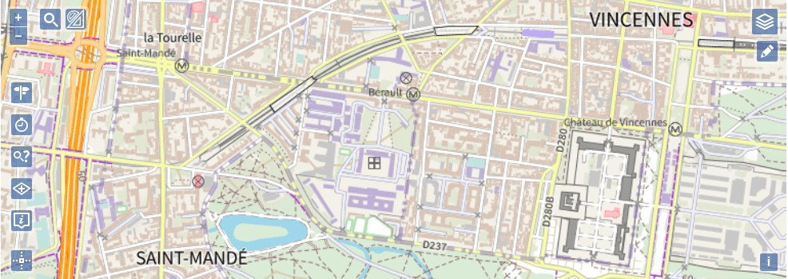

# Extensions Géoplateforme

---

---

Ce projet a pour but de fournir des extensions facilitant l'accès aux ressources de la [Géoplateforme](https://www.geoportail.gouv.fr/) pour la bibliothèque cartographique [OpenLayers](https://openlayers.org/) (versions 8 et supérieures).

Deux modes de compilation sont disponibles : 
- un mode classique
- un mode DSFR reprenant l'implémentation du DSFR

> AVERTISSEMENT : Le mode DSFR des extensions Géoplateforme pour OpenLayers est uniquement destiné à être utilisé pour les sites web officiels des services publics français.  
> Son objectif principal est de faciliter l'identification des sites gouvernementaux par les citoyens. [Voir les conditions](https://www.systeme-de-design.gouv.fr/utilisation-et-organisation/perimetre-d-application).

Ces extensions proposent des classes et widgets utilisables en complément de la bibliothèque cartographique qu'elles étendent, permettant notamment :

* d'afficher simplement les couches WMTS et WMS délivrées par la Géoplateforme ;

* d'intégrer un widget de gestion d'empilement des couches ;

* d'intégrer une barre de recherche utilisant le service de géocodage IGN ;

* de faire des calculs d'itinéraires à partir du service de la Géoplateforme ;

* de faire des calculs d'isochrones / isodistances à partir du service de la Géoplateforme ;

* d'afficher l'altitude en un point de la carte à l'aide du service d'altimétrie de la Géoplateforme.

* ...

##  OPENLAYERS

Voir le détail des [fonctionnalités proposées par l'extension Géoplateforme pour OpenLayers](doc/DOCUMENTATION.md)
